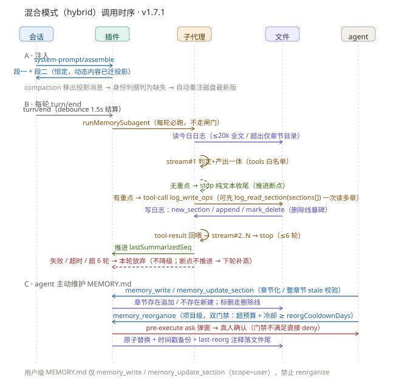
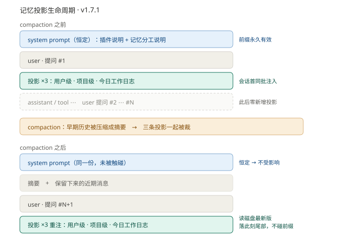

# 开发

## 目录结构

```
dsh-memory-palace/
├── src/
│   ├── index.mjs              # 插件后端入口（cordis 插件：name/Config/inject/apply，薄装配层：闭包运行时 + 工厂装配）
│   ├── common/                # 纯函数与常量（零状态，可独立单测）
│   │   ├── prompts.mjs        #   SCENE_KEYWORDS / SUMMARY_PROMPT / DISTILL_PROMPT
│   │   ├── text.mjs           #   todayISO / nowStamp / budgetClip / blockText / extractText / stripDeletedLines 等
│   │   ├── paths.mjs          #   createPaths 工厂（buddyDirs / writeDirs / memoryFileOf，cwd 参数化）
│   │   ├── records.mjs        #   createRecords 工厂 + appendLineDedup / findMatches / prune 等
│   │   ├── sections.mjs       #   章节纯函数：parse/locate/append/upsert/create/replace/markEntryDeleted（hybrid 用）
│   │   └── retry.mjs          #   蒸馏 LLM 失败重试：classifyFailure / backoffDelayMs / runWithRetry（纯函数，可单测）
│   ├── hybrid/                # 混合模式独立模块（memoryMode === "hybrid" 时由 index.mjs 装配，互不影响 plugin/smart）
│   │   ├── index.mjs          #   模块入口 registerHybrid（注册工具 + 闸门，返回 runMemorySubagent）
│   │   ├── prompts.mjs        #   HYBRID_PROACTIVE（注入段二）/ SUBAGENT_SYSTEM（子代理 system prompt）
│   │   ├── subagent.mjs       #   记忆子代理：ctx.llm.stream + tools 自建工具循环（log_read_section/log_write_ops）
│   │   └── tools.mjs          #   memory_write / memory_update_section / memory_reorganize + pre-execute 闸门
│   ├── distill.mjs            # 蒸馏核心：distillSessionCore / summarizeTurn / distillProjectMemory（乐观锁 + 原子覆盖）
│   ├── tools.mjs              # 四个记忆工具（memory_note / _user / _read / _delete）+ pre-execute 删除确认闸门
│   ├── api.mjs                # /memory-palace/api route（设置读写 + 手动蒸馏，HTTP trust-fence）
│   └── client/                # 前端 client 源码（build 按序零依赖拼接为 lib/client.js 单 bundle）
│       ├── 00-head.js         #   IIFE 头 + react / NS 初始化
│       ├── 10-locales.js      #   zh/en 文案
│       ├── 20-common.js       #   公共助手（fetch 封装等）
│       ├── 30-settings-section.js  # 设置页「记忆」面板（v1.7.1 起为折叠卡片 + 自定义指令板块）
│       ├── 40-sparkle.js      #   SPARKLE_SVG 图标常量（内联 sparkle-twinkle.svg）
│       ├── 50-distill-button.js   # 会话标题栏「记忆」按钮 + 下拉 + 自绘确认弹窗 + 浏览器通知
│       └── 90-tail.js         #   apply 装配 + settings.section / header.utilities 插槽注册
├── scripts/
│   └── build.mjs              # 构建：服务端递归复制 + index.js 入口重命名 + client 按序拼接（零外部依赖）
├── cordis.patch.yml           # bundle patch：向 profile 注入本插件配置
├── tests/                     # 测试脚本（node 直接运行，无测试框架依赖）
│   ├── test-load.mjs          # 后端 cordis 单测（注入/轻量兜底/错误捕获/桥接/去重/删除/确认弹窗/重试/回喂等 179 项）
│   ├── test-hybrid.mjs        # hybrid 单测（章节纯函数/子代理循环 mock/reorganize 门禁，20 项断言）
│   ├── test-v1.7.0.mjs        # 投影身份判据/路径/去噪/日志头单测（39 项）
│   ├── test-v1.4.1.mjs        # budgetClip / stripSmartTag 定向回归
│   ├── test-client-smoke.mjs  # 前端 client bundle 冒烟测试
│   └── verify-distill-route.mjs # 蒸馏 route 定向回归（activeCwd≠会话 cwd 时 durable 正确落同级 MEMORY.md）
├── lib/                       # 构建产物（由 src/ 生成，勿手改）
└── package.json
```

## 构建与测试

```bash
npm run build
node tests/test-load.mjs            # 后端单测：加载、注入、日志写入、buddy 桥接、去重、memory_read
node tests/test-hybrid.mjs          # hybrid 单测：章节纯函数、子代理循环（mock LLM）、重整双门禁
node tests/test-v1.7.0.mjs          # 投影/路径/去噪/日志头单测
node tests/test-client-smoke.mjs    # 前端冒烟：bundle 注册、settings.section / header.utilities 注入
node tests/verify-distill-route.mjs # 蒸馏 route 回归：手动蒸馏 durable 落同级 MEMORY.md（含 cwd 错位场景）
```

> 宿主的 `agent/pre-step` 等预览期契约可能随版本变动，升级 DSH 后需核对运行时包的类型声明（见「记忆注入通道」§7.4）。

## 技术要点

- **零依赖构建**：服务端 `src/index.mjs`（含 `src/common/`、`src/distill.mjs`、`src/tools.mjs`、`src/api.mjs`）是标准 ESM，运行时由装载本包的 profile 解析 `@deepseek-ai/*` 依赖，build 纯复制即可；浏览器端 `src/client/`（00-head…90-tail）经 build 按序**零依赖拼接**为 `lib/client.js` 单自包含 bundle——dsh 客户端模块系统（`packages/client/modules`）不支持插件相对 `require`，多文件只能拼接合并不引入打包器。
- **同步读取**：`systemPrompt.section` 的 `text()` 必须同步（harness 源码不 await），故读盘用 `readFileSync`；写盘走异步 `node:fs/promises`，不在同步热路径上。记忆正文投影（`src/projection.mjs`）同样走同步读盘。
- **依赖约定**：`@deepseek-ai/*` 声明为 `peerDependencies`，运行时由 profile 的 `node_modules` 提供，本包不捆绑任何 harness 内部模块。
- **不引入 `dsh-storage`**：其 JSON 落地与"记忆必须可读的 Markdown"这一核心价值冲突，刻意排除。
- **设置页折叠卡片只能手写**：宿主 `ui-settings-plugins` 的 `PluginCard` 是「name 叠在 description 上」的竖向卡片；宿主导出的可复用组件 `DisclosureRow`（`ui-primitives`）是**横向 24px 紧凑行**，布局不同（宿主 README 亦明确区分二者）。且本包 client 只 `require("react")`（平台 seed 表），不引宿主图标包。故样式逐值照抄 `PluginCard.module.css`，chevron 用 data URI 内联 SVG。折叠态是 card-local 的纯前端 `useState`、**不持久化**（「用户打开哪张卡」是一次阅读手势），保存成功后自动收起。

## 混合模式（hybrid）要点

- **模块边界**：`src/hybrid/` 独立模块，仅 `memoryMode === "hybrid"` 时由 `index.mjs` 装配（切换需重启 dsh——注册时机安全）。不改动 `distill.mjs` / `tools.mjs` / `api.mjs` 及 plugin/smart 全部行为。
- **记忆子代理 = 自建工具循环**：`ctx.llm.stream` 原生支持 `GenerateOptions.tools`（`finish.kind === 'tool-calls'` 时用 `BlockAssembler.message()` 回喂 assistant 消息 + `createToolResultMessage` 回喂工具结果）——无需 `ctx.subagents`（其要求活 Agent 作父，插件不可用）。循环白名单仅 `log_read_section` / `log_write_ops`。
- **章节化核心**：`src/common/sections.mjs` 纯函数（parse/locate/append/upsert/create/replace/markEntryDeleted）驱动日志 ops 与 MEMORY.md 工具；`replaceSectionText` 整章节归一化精确匹配防 stale，并**保留章节间分隔空行**。
- **reorganize 双门禁**：`checkReorgGate`（`src/hybrid/tools.mjs`）机器校验「超出 `workspaceBudgetChars` 且距上次重整 ≥ `reorgCooldownDays`」；时间戳 `<!-- memory-palace:last-reorg:... -->` 由机器读写落 MEMORY.md 文件尾；pre-execute 确认弹窗 + execute 复核双重防线，原子替换沿 distillProjectMemory 的 cover/备份/rename 模式。
- **hybrid 下日志永不过期**：`records.prune()` 对 hybrid 直接返回（`dailyLogRetentionDays` 不可用，日志作为子代理维护的证据层保留）。
- **写入并发**：子代理日志落盘经模块级 promise 链（`withLogLock`）串行化，防与手动蒸馏按钮并发覆盖。
- **多章节读取（A 改进）**：`log_read_section` 接受 `sections: string[]`，一次读取多个章节合并返回（未找到的注明）；prompt 强制要求多章节单次传齐（C 改进），避免多轮往返。目录模式典型流程 2-3 轮即可完成。
- **失败不降级**：子代理超 6 轮 / 超时 / 模型不支持 tools → 本轮放弃，**不写 `writeLightEntry`**（无格式原文会破坏日志章节化结构）；断点不推进，下一次 turn/end 子代理自动补蒸。`writeLightEntry` 仍被 plugin/smart 模式使用。
- **踩坑**：`node:fs` 的 `writeFile`/`mkdir` 是 callback 版，`await` 会抛 `ERR_INVALID_CALLBACK` 被 catch 吞掉导致静默不落盘——写文件一律用 `node:fs/promises`。

### 调用时序



## 记忆注入通道

记忆注入分两条通道，分流依据是**内容是否恒定**（v1.7.1 起）：

| 内容 | 通道 | 理由 |
|---|---|---|
| **恒定指令**：记忆插件 intro + 记忆分工 prompt + 用户自定义指令 | **`systemPrompt.section`**：每步同步注入 | 内容恒定 → system prompt 不抖动 → **前缀缓存永久有效**（零成本） |
| **易变内容**：用户级 / 项目级 `MEMORY.md`、今日工作日志 | **E 投影**（`src/projection.mjs`）：`agent/pre-step` 投影为常驻 user 消息 | 追加在历史尾部、按**文件身份**各只注一次 → 不触碰已有前缀 |

自定义指令（`customInstructions`，v1.7.1 特性3）由用户在设置页「自定义指令」板块配置，拼接在**记忆分工 prompt 之后** ——
拼接顺序即 system prompt 里的实际排布（同一 section 内完成，`order: 50` 不变）。留空或纯空白时不注入。
它属恒定内容，故留在 section 而非走投影 —— 与「内容是否恒定」的分流依据一致。

> ⚠️ **切勿把任何「每步可能变化」的内容放回 section** —— section 位于序列**最前**，一变就让其后整段前缀作废。
> 实测（`testdata/session.v3.jsonl`，10 turn / 253 请求）：v1.7.0「日志走 section」形态下命中率仅 **94.53%**，
> 9 次全量重算吃掉了 86.5% 的 miss token；日志迁出后预期 **≥ 99.5%**（除会话首个请求外无 cold）。

投影的完整生命周期（会话首注入、内容变更不重注、compaction 后重注）见下图：



### 7.1 E 投影三件套

照抄宿主 `packages/context/agent-instructions`（API 全公开，无第一方特权）：

1. `inject: ['sessionProjections']`（服务随 `dsh-base` 默认装载）；
2. `ctx.on('agent/pre-step', async ({ agent, messages, step, signal }, next) => ...)`；
3. `createUserMessage()`（`@deepseek-ai/dsh-llm`）。

投递走**同步版**：`await next()` 后折叠进 `decision.messages`——
`decision.messages.toSpliced(lastClaimedIndex + 1, 0, ...pending)`，
其中 `lastClaimedIndex = decision.messages.findLastIndex(m => messages.includes(m))`。
不做异步 inbox 刷新（agent-instructions 注释指出异步投影受两个 commit 边界约束，本版刻意回避）。

### 7.2 source 标注与去重

- source = `{ kind: 'plugin', plugin: 'dsh-memory-palace', form: 'instructions' }`。
  `form` 必须是宿主 `ContextForm` 联合内的值（该联合为判别类型，`form: 'memory'` 之类**类型不合法**）。
- v1.7.1 去重判据 = **文件身份**（`sameProjectionIdentity`）：取消息**首行 heading** 作身份
  （形如 `# 项目级记忆 (<path>)` / `# 今日工作日志 (<date> @ <dir>)`），且要求双方 `source` 均属本插件
  （`isOwnProjection`，规避真实用户消息与宿主注入消息因首行巧合而误撞）。**只比身份、不比正文**。
- 去重三级：① 本步 `messages` 已含同身份 → 跳过；② `decision.messages` 已含同身份 → 跳过；
  ③ 扫 `session.surface.nodes` 经 `eventAt(seq)` 找同身份的 own message → 跳过。
- 由此得到的性质：**同一文件只注一次**，内容再变也不重注（记忆正文由 agent 自己写入，其内容本就在
  上下文里，重注纯属冗余）；换文件（跨日期日志）才视为新身份；compaction 把消息移出 surface 后判为缺失 →
  **自动重注磁盘最新版**，顺带完成一次「刷新到最新」（故无需 `injectedSessionIds` 之类标记机制）。

### 7.3 连带修复：turnBuffer 采集过滤

投影消息是 `role: 'user'`，会进 `session/event`。若不过滤，它会被采集进 `turnBuffer`
并触发「新用户请求到来 → 先结算上一个 request」的 `_flushTurn()`，打乱 request 边界、
污染关键词闸门（结算时取第一条 user 文本）。故 `turnBuffer` 采集只收
`source.kind === 'user'` 的真实用户消息（与子代理去噪口径一致）。

### 7.4 🔴 契约风险与降级

`agent/pre-step` 监听器抛错会让**整个 turn 失败**（宿主测试 `packages/acp/acp/tests/turns.spec.ts:150-156` 锚定），
故钩子内**整体 try-catch**，异常时降级为「本步不投影」并打一行 stderr 线索，绝不冒泡。
代价：契约失效时表现为**记忆正文不注入**而非报错。

该通道依赖宿主预览期 API（`agent/pre-step` 事件、`createUserMessage`、`MessageSourceMap` 的 `form` 枚举、
`Session.surface` 与 `ctx.sessionProjections`）。DSH 处于开发者预览阶段，升级后须核对运行时包的类型声明
（`$(npm root -g)/@deepseek-ai/dsh/node_modules/@deepseek-ai/`）；行号随版本漂移，勿依赖。

## 路径读取优先级

`src/common/paths.mjs` 的 `readDirs()` 与 `writeDirs()` 读写顺序**不对称**：

| 操作 | 顺序 | 说明 |
|---|---|---|
| 读取 | `.deepseek-harness` > `.workbuddy` > `.codebuddy` | dsh 原生恒在首位，buddy 目录**叠加** |
| 写入 | `.workbuddy` > `.codebuddy` > `.deepseek-harness` | buddy 优先；都不存在才回退 dsh 目录（按需创建） |

读写顺序**刻意不对称**：dsh 原生记忆必须可被读到（否则与 buddy 目录共存时静默失效），而写入仍以 buddy 目录为首选（兼容 WB/CB 原生格式）。

## 智能模式蒸馏 —— 失败重试

蒸馏（会话摘要 `distillSessionCore` + 项目记忆 `distillProjectMemory`）的 LLM 调用经 `src/common/retry.mjs` 的 `runWithRetry` 包裹，单次尝试由 `distill.mjs` 内的 `streamOnce` 负责（每次新建独立 `AbortSignal`，避免单次超时耗尽累计预算）。

真源代码：`src/common/retry.mjs`（`classifyFailure` / `backoffDelayMs` / `runWithRetry` / `RETRY_CONSTANTS` / `LlmRetryExhausted`）。

### 6.1 错误分类 `classifyFailure(err)` → `retryable` | `limited` | `fatal`

| 分类 | 触发条件（status / code / 文本） | 是否重试 | 说明 |
|---|---|---|---|
| `limited` | `429` 限流 / `529` 过载 | ✅ 退避重试 | 速率/负载限制，等待后可继续，同走指数退避 |
| `retryable` | `5xx` 服务端错误（含 `500`） | ✅ 退避重试 | 瞬时服务端故障；其中 `500-class` 单独限 `HTTP500_MAX_RETRIES` 次（多为主服务挂，重试意义不大且拖慢降级） |
| `retryable` | 网络类：`ECONNRESET` / `ETIMEDOUT` / `ECONNREFUSED` / `ENETUNREACH` | ✅ 退避重试 | 瞬态网络波动或服务器负载高 |
| `retryable` | 超时/中断：`AbortError` / `ABORT_ERR` / 文本含 `aborted\|timeout\|timed out\|deadline` | ✅ 退避重试 | 单次独立 `AbortSignal` 触发，不耗尽累计预算 |
| `fatal` | `401` / `403` 鉴权、`404` 模型不存在、`400` 永久客户端错误 | ❌ 不重试 | 需修正密钥/请求，重试无效 |
| `fatal` | `ENOTFOUND`（DNS 解析失败） | ❌ 不重试 | 通常需人工干预（升级计划明确要求不重试） |
| `fatal` | 兜底未知错误 | ❌ 不重试 | 不盲目重试，避免死循环 |

> 判定顺序（源码）：fatal 状态码（401/403/404/400）→ limited（429/529）→ retryable（5xx）→ 网络类 code → 超时/中断文本 → 兜底 fatal。

### 6.2 退避算法 `backoffDelayMs(attempt)`

```
delay = min(BASE_DELAY_MS * FACTOR^attempt, MAX_DELAY_MS) + jitter(≤15%)
attempt 从 0 起算（第 1 次重试前等待 base_delay）
```

常量固化于 `RETRY_CONSTANTS`：

| 常量 | 值 | 含义 |
|---|---|---|
| `BASE_DELAY_MS` | `2000` | 初始等待（2s） |
| `FACTOR` | `2` | 指数增长因子（每次翻倍） |
| `MAX_RETRIES` | `3` | 通用最大重试次数 |
| `MAX_DELAY_MS` | `32000` | 单次退避上限（32s） |
| `HTTP500_MAX_RETRIES` | `1` | `500-class` 单独重试上限（谨慎重试） |

`jitter = random() * (base * 0.15)` —— 随机抖动防止分布式「重试风暴 / 惊群效应」。

### 6.3 重试语义 `runWithRetry(makeAttempt, opts)`

- `limited` / `retryable` 在次数上限内指数退避重试：`500` 类上限取 `HTTP500_MAX_RETRIES`，其余取 `MAX_RETRIES`。
- `fatal` 立即抛出 `LlmRetryExhausted`（携带 `cls` 分类与 `attempts` 尝试次数），由调用方降级：
  - 会话摘要（`distillSessionCore`）→ 回退轻量条目；
  - 项目蒸馏（`distillProjectMemory`）→ 返回失败消息，**原记忆不动**。
- 成功 / `max-tokens` 直接返回（文本解析交给 caller；JSON 解析失败自然回落轻量兜底）。

### 6.4 调用约定

- `makeAttempt` 内部**每次新建独立 `AbortSignal`**（单次超时，不耗尽累计预算）。
- `max-tokens` **不算失败**，正常返回已有文本供 caller 解析。
- 蒸馏 chat completion 幂等，重试安全；若有函数调用副作用需另行评估幂等性。

提示词与蒸馏契约见 [PROMPTS.md](./PROMPTS.md)；配置项（超时 / 调试日志 / 最大 Token）见 [CONFIG.md](./CONFIG.md)。
