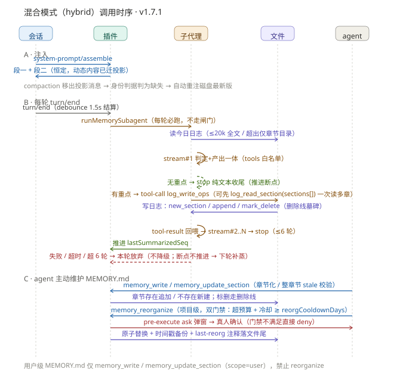
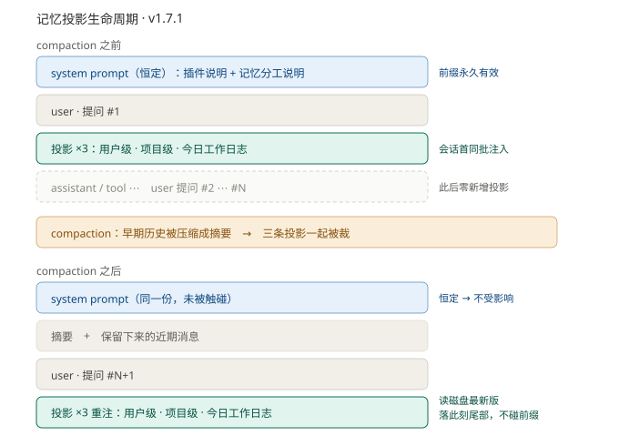

# 开发

## 目录结构

```
dsh-memory-palace/
├── src/
│   ├── index.mjs              # 插件后端入口（cordis 插件：name/Config/inject/apply，薄装配层：闭包运行时 + 工厂装配）
│   ├── common/                # 纯函数与常量（零状态，可独立单测）
│   │   ├── prompts.mjs        #   REORG_COMMAND_PROMPT（会话命令 /memory_reorganize 的内置提示 + 消息前缀）
│   │   ├── text.mjs           #   todayISO / nowStamp / budgetClip / blockText / extractText / stripDeletedLines 等
│   │   ├── paths.mjs          #   createPaths 工厂（buddyDirs / writeDirs / memoryFileOf，cwd 参数化）
│   │   ├── records.mjs        #   appendLineDedup / findMatches / removeLineByMatch / recentLogDates（纯函数）
│   │   ├── sections.mjs       #   章节纯函数：parse/locate/append/upsert/create/replace/markEntryDeleted（hybrid 用）
│   │   └── logger.mjs         #   统一日志落盘：createLogger（profile 目录 .memory-palace/logs/<sid>/{info,debug}.log，按级别分流）
│   ├── hybrid/                # 记忆子代理独立模块（v1.8.0 起为唯一写入路径，由 index.mjs 无条件装配）
│   │   ├── index.mjs          #   模块入口 registerHybrid（注册工具 + 闸门，返回 runMemorySubagent）
│   │   ├── prompts.mjs        #   HYBRID_PROACTIVE（注入段二）/ SUBAGENT_SYSTEM（子代理 system prompt）
│   │   ├── subagent.mjs       #   记忆子代理：ctx.llm.stream + tools 自建工具循环（log_read_section/log_write_ops）
│   │   └── tools.mjs          #   memory_write / memory_update_section / memory_reorganize + pre-execute 闸门
│   ├── tools.mjs              # 四个记忆工具（memory_note / _user / _read / _delete）+ pre-execute 删除确认闸门
│   ├── api.mjs                # /memory-palace/api route（设置读写，HTTP trust-fence）
│   ├── projection.mjs         # E 投影：agent/pre-step 把记忆正文/今日日志注为常驻 user 消息（可跳首步）
│   └── client/                # 前端 client 源码（build 按序零依赖拼接为 lib/client.js 单 bundle）
│       ├── 00-head.js         #   IIFE 头 + react / NS 初始化
│       ├── 10-locales.js      #   zh/en 文案
│       ├── 20-common.js       #   公共助手（fetch 封装等）
│       ├── 30-settings-section.js  # 设置页「记忆」面板（v1.7.1 起为折叠卡片 + 自定义指令板块）
│       ├── 40-sparkle.js      #   SPARKLE_SVG 图标常量 + twinkle keyframes（设置页 nav 星标用）
│       └── 90-tail.js         #   apply 装配 + settings.section 插槽注册
├── scripts/
│   └── build.mjs              # 构建：服务端递归复制 + index.js 入口重命名 + client 按序拼接（零外部依赖）
├── cordis.patch.yml           # bundle patch：向 profile 注入本插件配置
├── tests/                     # 测试脚本（node 直接运行，无测试框架依赖）
│   ├── test-load.mjs          # 后端 cordis 单测（注入/桥接/去重/删除/确认弹窗/plan/静默预设等 112 项）
│   ├── test-hybrid.mjs        # hybrid 单测（章节纯函数/子代理循环 mock/reorganize 门禁/闸门置位，26 项断言）
│   ├── test-command.mjs       # 会话命令 /memory_reorganize 单测（门禁/steer/掩码/首步跳过/可选依赖）
│   ├── test-v1.7.0.mjs        # 投影身份判据/路径/去噪/日志头单测（39 项）
│   ├── test-v1.4.1.mjs        # budgetClip / stripSmartTag 定向回归
│   └── test-client-smoke.mjs  # 前端 client bundle 冒烟测试
├── lib/                       # 构建产物（由 src/ 生成，勿手改）
└── package.json
```

## 构建与测试

```bash
npm run build
node tests/test-load.mjs            # 后端单测：加载、注入、日志写入、buddy 桥接、去重、memory_read
node tests/test-hybrid.mjs          # hybrid 单测：章节纯函数、子代理循环（mock LLM）、重整双门禁
node tests/test-command.mjs         # 会话命令：门禁拒绝 / steer 内置提示 / 禁用 memory_read / 首步跳过投影
node tests/test-subagent-log.mjs    # 日志落盘单测：门控 / 分级分流 / 隐私红线 / 多会话隔离 / 1MB 上限
node tests/test-settle-cwd.mjs      # 写侧串台回归：并发结算下记忆与日志的双写隔离（真实 apply）
node tests/test-session-cwd.mjs     # 读侧串台回归：多会话 cwd 隔离
node tests/test-planmode-crosstalk.mjs  # plan 模式跨会话串台回归
node tests/test-v1.4.1.mjs          # 日志级别与预算语义
node tests/test-v1.7.0.mjs          # 投影/路径/去噪/日志头单测
node tests/test-client-smoke.mjs    # 前端冒烟：bundle 注册、settings.section 注入、已删配置键负向断言
```

> 宿主的 `agent/pre-step` 等预览期契约可能随版本变动，升级 DSH 后需核对运行时包的类型声明（见「记忆注入通道」§7.4）。

## 日志落盘

v1.8.0-alpha.4 起，插件的**全部诊断输出改为落盘**，不再写 stderr。原因：Desktop 下插件 stderr 只进 host
进程内存（`apps/desktop/src/host-process.ts` 存末 64KB），仅崩溃时随报告落盘——正常运行时完全不可见，
子代理的失败/跳过因此无痕可查。

实现：`src/common/logger.mjs`（`createLogger`），由 `src/index.mjs` 装配并注入
`hybrid/subagent.mjs` / `projection.mjs`。

### 开启方式与相关配置

| 配置键 | 默认 | 说明 |
|---|---|---|
| `distillDebugLog` | `false` | **总开关**：`true` 才落盘；`false`（默认）时**零输出**——既不写文件也不写终端。设置页「记忆 → 开发」卡片可改 |
| `distillLogLevel` | `info` | `info` = 只落元数据；`debug` = 额外把 **LLM 原始响应文本**落盘。**无 UI**，经 profile 的 `cordis.patch.yml` 在 `memory-palace` 条目 `config` 下设置。⚠️ v1.8.1 起**暂无 raw 生产者**（唯一调用方是已移除的手动蒸馏链路；记忆子代理产出结构化 ops、无原文），该级别当前不改变实际输出 |

> ⚠️ 默认配置下插件**完全静默**（连失败留痕也不落盘，异常告警 `projection skipped` / `tool-hide skipped`
> 一并静默）——排查前必须先开 `distillDebugLog`。该值为 volatile，热改即生效、无需重启。

### 落盘位置

```
$DSH_HOME/profiles/<profile>/.memory-palace/logs/<session-id>/
├── info.log     # warn / info 级：失败与跳过留痕、子代理终态台账
└── debug.log    # debug 级：详单（模型解析 / 请求参数 / 流进度 / ops 统计）+ LLM 原始响应
```

- **按会话隔离**：`<session-id>` = 宿主会话 id（形如 `session-<uuid>`）；拿不到会话身份时落 `__nosession__/`
- profile 目录经宿主 `profileContext` 服务取（`ctx.get('profileContext').dir`），CLI 与 Desktop 同一 `runProfile` 路径注入
- 结构仿 dsh 原生 `@deepseek-ai/dsh-plugin-manager`（其日志在 `<profileDir>/.plugin-manager/logs/`）
- 单文件上限 **1 MB**，超限停止追加（不删旧内容）；**不自动清理**
- 目录 `0700` / 文件 `0600`（Windows 忽略 mode，同原生插件）

### 行格式

```
2026-09-28 17:39:37.324 [debug] subagent · stream turn {"round":0,"chunks":938,"deltaChars":7799,"firstChunkMs":1457,"elapsedMs":27082}
```

`<本地时间戳> [<级别>] <模块> · <what> <JSON 元数据>`。时间戳用**本地时间**（非 UTC，与日志文件名同源教训）。

### 模块与常用字段

| 模块 | 典型行 | 用途 |
|---|---|---|
| `subagent` | `entry` · `stream turn` · `tool-calls round` · `tool ok` · `done` | 每轮记忆结算。`stream turn` 的 `firstChunkMs`（首包耗时）与 `elapsedMs`（总耗时）用于判断慢在**网关排队**还是**模型生成** |
| `subagent`（台账） | `done ok=… mode=…`（落在 `info.log`） | 每轮一行，含 `appliedWrites` / `toolAttempts` / `unknownHits` / `retries` / `cwd` / `isError` |
| `projection` · `plugin` | `projection skipped` · `tool-hide skipped` | 异常降级告警 |

### 隐私

- 元数据只含计数、字符数、模型名、路径等，**不含对话正文**
- `distillLogLevel=debug` 的 raw 通道（LLM 原始响应落 `debug.log`）定位为「受信本地排障」、仅本地开启；v1.8.1 起其唯一生产者（手动蒸馏）已移除，当前无开发者调用
- 落点在 `$DSH_HOME`（宿主数据目录），**不在用户项目内**，不会被 git 提交

## 技术要点

- **零依赖构建**：服务端 `src/index.mjs`（含 `src/common/`、`src/tools.mjs`、`src/api.mjs`、`src/projection.mjs`）是标准 ESM，运行时由装载本包的 profile 解析 `@deepseek-ai/*` 依赖，build 纯复制即可（并清理 `src/` 已删文件在 `lib/` 的陈旧副本）；浏览器端 `src/client/`（00-head…90-tail）经 build 按序**零依赖拼接**为 `lib/client.js` 单自包含 bundle——dsh 客户端模块系统（`packages/client/modules`）不支持插件相对 `require`，多文件只能拼接合并不引入打包器。
- **同步读取**：`systemPrompt.section` 的 `text()` 必须同步（harness 源码不 await），故读盘用 `readFileSync`；写盘走异步 `node:fs/promises`，不在同步热路径上。记忆正文投影（`src/projection.mjs`）同样走同步读盘。
- **依赖约定**：`@deepseek-ai/*` 声明为 `peerDependencies`，运行时由 profile 的 `node_modules` 提供，本包不捆绑任何 harness 内部模块。
- **不引入 `dsh-storage`**：其 JSON 落地与"记忆必须可读的 Markdown"这一核心价值冲突，刻意排除。
- **设置页折叠卡片只能手写**：宿主 `ui-settings-plugins` 的 `PluginCard` 是「name 叠在 description 上」的竖向卡片；宿主导出的可复用组件 `DisclosureRow`（`ui-primitives`）是**横向 24px 紧凑行**，布局不同（宿主 README 亦明确区分二者）。且本包 client 只 `require("react")`（平台 seed 表），不引宿主图标包。故样式逐值照抄 `PluginCard.module.css`，chevron 用 data URI 内联 SVG。折叠态是 card-local 的纯前端 `useState`、**不持久化**（「用户打开哪张卡」是一次阅读手势），保存成功后自动收起。

## 记忆子代理（原 hybrid）要点

- **模块边界**：`src/hybrid/` 独立模块（v1.8.0 起为唯一写入路径，plugin / smart 已删除），由 `index.mjs` **无条件装配**（apply 同步段读不到热配置，条件注册会踩「配置启用但未注册」的坑）。不改动 `tools.mjs` / `api.mjs` 的基础记忆工具与设置 route 行为。
- **记忆子代理 = 自建工具循环**：`ctx.llm.stream` 原生支持 `GenerateOptions.tools`（`finish.kind === 'tool-calls'` 时用 `BlockAssembler.message()` 回喂 assistant 消息 + `createToolResultMessage` 回喂工具结果）——无需 `ctx.subagents`（其要求活 Agent 作父，插件不可用）。循环白名单仅 `log_read_section` / `log_write_ops`。
- **章节化核心**：`src/common/sections.mjs` 纯函数（parse/locate/append/upsert/create/replace/markEntryDeleted）驱动日志 ops 与 MEMORY.md 工具；`replaceSectionText` 整章节归一化精确匹配防 stale，并**保留章节间分隔空行**。
- **reorganize 双门禁**：`checkReorgGate`（`src/hybrid/tools.mjs`）机器校验「超出 `workspaceBudgetChars` 且距上次重整 ≥ `reorgCooldownDays`」（阈值刻意 = 注入预算：**超出注入预算 = 该重整了**；门禁只看 `writeDirs[0]` 的主目标 MEMORY.md，buddy 目录那份不参与判定）；时间戳 `<!-- memory-palace:last-reorg:... -->` 由机器读写落 MEMORY.md 文件尾；pre-execute 确认弹窗 + execute 复核双重防线，原子替换走 cover/备份/rename 模式（备份名 `MEMORY.md.<本地时间戳>`、与原文件同目录）。会话命令 `/memory_reorganize` 与工具**共用同一套门禁**。
- **重整流程 = 禁 `memory_read`（v1.8.1）**：`memory_read` 的 scope 只到 today/yesterday/近三天，读不到更早的日志，不足以支撑通盘重整。故两条入口都在 `state` 上置位「重整流程」标记（`reorgBySession`），使该会话的工具掩码额外 deny `memory_read`（与静默预设掩码合并成**一个** deny 集合，避免双重 `restrict` 互相覆盖），逼 agent 改用自身文件读取能力直接读 MEMORY.md 与 `memory/` 目录（含历史日期）：① 会话命令 `/memory_reorganize`（handler 内先过门禁再置位）；② agent 自动调 `memory_reorganize` 工具（`attachHybridGuards` 的 pre-execute 在门禁通过后置位）。标记的摘除 = 下一条**非命令注入**的真实用户消息 / `agent/disposed` / 30 分钟 TTL（惰性）——刻意不挂 settle 判据，因为命令注入的消息本身也会触发缓冲 flush，会把刚戴上的掩码立刻误摘。
- **日志永不过期**：日志作为子代理维护的证据层保留，v1.8.0 起 `records.prune()` 与 `dailyLogRetentionDays` 配置一并删除。
- **写入并发**：子代理日志落盘经模块级 promise 链（`withLogLock`）串行化，防与另一条写入路径并发覆盖。
- **多章节读取（A 改进）**：`log_read_section` 接受 `sections: string[]`，一次读取多个章节合并返回（未找到的注明）；prompt 强制要求多章节单次传齐（C 改进），避免多轮往返。目录模式典型流程 2-3 轮即可完成。
- **失败不降级**：子代理超 6 轮 / 超时 / 模型不支持 tools → 本轮放弃，**不写任何轻量原文**（会破坏日志章节化结构）；断点不推进，下一次 turn/end 子代理自动补蒸。
- **踩坑**：`node:fs` 的 `writeFile`/`mkdir` 是 callback 版，`await` 会抛 `ERR_INVALID_CALLBACK` 被 catch 吞掉导致静默不落盘——写文件一律用 `node:fs/promises`。

### 调用时序



## 记忆注入通道

记忆注入分两条通道，分流依据是**内容是否恒定**（v1.7.1 起）：

| 内容 | 通道 | 理由 |
|---|---|---|
| **恒定指令**：记忆插件 intro + 记忆分工 prompt + 用户自定义指令 | **`systemPrompt.section`**：每步同步注入 | 内容恒定 → system prompt 不抖动 → **前缀缓存永久有效**（零成本） |
| **易变内容**：用户级 / 项目级 `MEMORY.md`、今日工作日志 | **E 投影**（`src/projection.mjs`）：`agent/pre-step` 投影为常驻 user 消息 | 追加在历史尾部、按**文件身份**各只注一次 → 不触碰已有前缀 |

自定义指令（`customInstructions`，v1.7.1 特性3）由用户在设置页「自定义指令」板块配置，拼接在**记忆分工 prompt 之后** ——
拼接顺序即 system prompt 里的实际排布（同一 section 内完成，`order: 50` 不变）。留空或纯空白时不注入。
它属恒定内容，故留在 section 而非走投影 —— 与「内容是否恒定」的分流依据一致。

> ⚠️ **切勿把任何「每步可能变化」的内容放回 section** —— section 位于序列**最前**，一变就让其后整段前缀作废。
> 实测（`testdata/session.v3.jsonl`，10 turn / 253 请求）：v1.7.0「日志走 section」形态下命中率仅 **94.53%**，
> 9 次全量重算吃掉了 86.5% 的 miss token；日志迁出后预期 **≥ 99.5%**（除会话首个请求外无 cold）。

**极简模式 / 静默预设（v1.7.2）**：宿主把「模式」实现为 **agent 平面预设**（`packages/preset/agent-presets/presets/*/agent.cordis.yml`）——官方 `minimal` 用 persona `complete: true` 独占 system prompt，并关掉 runtime context，是刻意留白的「裸测环境」（跑分口径）。`dsh-system-prompt` 装配末尾会把 sections 收缩为 `[completeSection]`（`lib/index.js:332-356`），harness identity / 所有插件 section / assemble 瀑布的修改一并作废——**契约内行为，不是注入失败**。

关键点在于：本插件注册在 **host 平面**（profile bundle 的 insert），而预设只决定 agent 平面的工具/prompt/skills。于是「预设不带它」并不会让它停下——`systemPrompt.section`（全局层）、`agent/pre-step` 投影、`ctx.tools.register`（全局工具层）对**每个 agent** 都生效，且 `complete` 只吞 sections、**不裁 tools**。实测症状：极简模式下 section 被吞，但记忆正文仍经 E 投影进历史、7 个记忆工具 schema 照发。故必须**自行按会话判定并整体静默**。

实现（`silentPresets`，默认 `["minimal"]`）：

| 通道 | 闸位 | 判据来源 |
|---|---|---|
| system section | `text(context)` 内 return `""` | `context.agent.session`（宿主 `assembleContextFor` = `{ agent, scope, signal }`） |
| E 投影 | `agent/pre-step` 钩子 + `buildProjections({ session })` 提前返回 | `agent.session` |
| turn-end 写入 / 错误捕获 / hybrid 子代理 | `_settle()` 开头提前返回（子代理分支在其下方，天然被拦） | `state.activeSession` |
| 工具 schema 隐身 | `agent/created` 戴掩码（`agent.ctx.tools.restrict({ deny: [7 工具] })`）；空会话切换预设时由 `agent-preset/selected` 重新同步（戴上/摘下），`agent/disposed` 释放 | `agent.session` |

判据 = 会话创建头 `session.header.agentPreset`（由 session-controller 的 `composeAgent` 写入**解析后**的 id，含未显式指定时的部署默认）∪ `agent-preset/selected` 事件（仅空会话可切；由 `session/event` 监听存入 `state.presetBySession`）。二者合起来等价于宿主的 `agentPreset` 会话投影（init=header，apply=该事件），故**无需注入 `sessionProjections` 服务**。判据缺失一律 **fail-open**（视为不静默）——绝不能因识别不到预设而丢记忆。

三个机制约束：① `enabled` / `silentPresets` 都是热配置，`apply()` 同步段读不到 → **不能条件注册**（否则切回后工具从未注册，同 v1.6.0 hybrid 踩坑）；② `tools.restrict()` 要求 agent 作用域 ctx、静态名单、dispose 才解除，故只能挂 `agent/created`（并由 `agent/disposed` 释放）；③ 掩码在 agent 创建时按该会话预设戴上（同 model selection 的「装配前冻结」语义）——运行中热切配置只影响后续新建 agent，但**同一会话内切换预设**（仅空会话允许）会经 `agent-preset/selected` 立即重算掩码，因为此时模型还没看过任何内容，能力集必须与新预设一致；残留 schema 由 execute 内的 `enabled` 兜底保证功能仍停用。deny 名单不含子 agent 内部工具 `log_read_section` / `log_write_ops`（它们经 `ctx.llm.stream` 的 tools 参数传入、不入全局层，列入会命中 unknown-tool 抛错）。

投影的完整生命周期（会话首注入、内容变更不重注、compaction 后重注）见下图：



### 7.1 E 投影三件套

照抄宿主 `packages/context/agent-instructions`（API 全公开，无第一方特权）：

1. `inject: ['sessionProjections']`（服务随 `dsh-base` 默认装载）；
2. `ctx.on('agent/pre-step', async ({ agent, messages, step, signal }, next) => ...)`；
3. `createUserMessage()`（`@deepseek-ai/dsh-llm`）。

投递走**同步版**：`await next()` 后折叠进 `decision.messages`——
`decision.messages.toSpliced(lastClaimedIndex + 1, 0, ...pending)`，
其中 `lastClaimedIndex = decision.messages.findLastIndex(m => messages.includes(m))`。
不做异步 inbox 刷新（agent-instructions 注释指出异步投影受两个 commit 边界约束，本版刻意回避）。

### 7.2 source 标注与去重

- source = `{ kind: 'plugin', plugin: 'dsh-memory-palace', form: 'instructions' }`。
  `form` 必须是宿主 `ContextForm` 联合内的值（该联合为判别类型，`form: 'memory'` 之类**类型不合法**）。
- v1.7.1 去重判据 = **文件身份**（`sameProjectionIdentity`）：取消息**首行 heading** 作身份
  （形如 `# 项目级记忆 (<path>)` / `# 今日工作日志 (<date> @ <dir>)`），且要求双方 `source` 均属本插件
  （`isOwnProjection`，规避真实用户消息与宿主注入消息因首行巧合而误撞）。**只比身份、不比正文**。
- 去重三级：① 本步 `messages` 已含同身份 → 跳过；② `decision.messages` 已含同身份 → 跳过；
  ③ 扫 `session.surface.nodes` 经 `eventAt(seq)` 找同身份的 own message → 跳过。
- 由此得到的性质：**同一文件只注一次**，内容再变也不重注（记忆正文由 agent 自己写入，其内容本就在
  上下文里，重注纯属冗余）；换文件（跨日期日志）才视为新身份；compaction 把消息移出 surface 后判为缺失 →
  **自动重注磁盘最新版**，顺带完成一次「刷新到最新」（故无需 `injectedSessionIds` 之类标记机制）。

### 7.3 连带修复：turnBuffer 采集过滤

投影消息是 `role: 'user'`，会进 `session/event`。若不过滤，它会被采集进 `turnBuffer`
并触发「新用户请求到来 → 先结算上一个 request」的 `_flushTurn()`，打乱 request 边界、
污染关键词闸门（结算时取第一条 user 文本）。故 `turnBuffer` 采集只收
`source.kind === 'user'` 的真实用户消息（与子代理去噪口径一致）。

### 7.4 🔴 契约风险与降级

`agent/pre-step` 监听器抛错会让**整个 turn 失败**（宿主测试 `packages/acp/acp/tests/turns.spec.ts:150-156` 锚定），
故钩子内**整体 try-catch**，异常时降级为「本步不投影」并留一行诊断，绝不冒泡。
代价：契约失效时表现为**记忆正文不注入**而非报错。

该通道依赖宿主预览期 API（`agent/pre-step` 事件、`createUserMessage`、`MessageSourceMap` 的 `form` 枚举、
`Session.surface` 与 `ctx.sessionProjections`）。DSH 处于开发者预览阶段，升级后须核对运行时包的类型声明
（`$(npm root -g)/@deepseek-ai/dsh/node_modules/@deepseek-ai/`）；行号随版本漂移，勿依赖。

## 路径读取优先级

`src/common/paths.mjs` 的 `readDirs()` 与 `writeDirs()` 读写顺序**不对称**：

| 操作 | 顺序 | 说明 |
|---|---|---|
| 读取 | `.deepseek-harness` > `.workbuddy` > `.codebuddy` | dsh 原生恒在首位，buddy 目录**叠加** |
| 写入 | `.workbuddy` > `.codebuddy` > `.deepseek-harness` | buddy 优先；都不存在才回退 dsh 目录（按需创建） |

读写顺序**刻意不对称**：dsh 原生记忆必须可被读到（否则与 buddy 目录共存时静默失效），而写入仍以 buddy 目录为首选（兼容 WB/CB 原生格式）。

## 会话命令 /memory_reorganize（v1.8.1）

用户手动触发项目记忆重整的唯一入口（原客户端「蒸馏项目记忆」按钮与其服务端蒸馏链路已在 v1.8.1 整体移除）。

- **注册**：`src/index.mjs` 内 `ctx.inject(["commands"], (c) => c.effect(() => c.commands.register({...})))`。`commands` 是**可选依赖**——无命令面的部署里子 fiber 不加载，插件主体照常 ACTIVE（绝不 pending）。
- **宿主契约**：命令注册表**自身不提交模型消息**，必须 handler 亲自提交——本插件用 `agent.steer(createUserMessage({ content:[{type:'text',text:内置提示}], source:{kind:'user'} }))` 把内置提示作为一条用户消息发给模型。命令名限 `^[a-z][a-z0-9_-]*$`；第三方命令无 i18n，中文文案只能写进 `description`。
- **handler 门禁顺序**：`enabled` → 会话静默（`isSessionSilent`）→ plan 模式 → 有活动工作区 → `checkReorgGate`（超注入预算 且 过冷却）。任一不过**直接返回 `{kind:'error',text}`**、不产生任何消息。
- **内置提示**（`REORG_COMMAND_PROMPT`，`src/common/prompts.mjs`）：给出项目 `MEMORY.md` 绝对路径 + 日志目录绝对路径，要求列出 `memory/*.md`（含历史日期）自行读取；**任务定义 = 两删一提一重构**（删过时 / 删重复 / 冗余提炼不丢精度 / 重构结构）；预算 `workspaceBudgetChars` **只是健康参考线、非硬指标**（严禁为达标删除仍有效信息）；**只允许落盘一次**（草稿不会自动保存、不要反复推倒重来）；**必须调用 `memory_reorganize` 工具写入**（唯一带整档备份的路径）；被拦截则**停止并报告**、不绕道；禁动用户级记忆。首行带 `REORG_MESSAGE_PREFIX`（`【项目记忆重整任务】`），用于把命令注入的消息与用户后续真实消息区分开。
- **跳过首步投影**：命令触发请求的**第一个 step** 不投影项目级 MEMORY.md 与今日日志（用户级照常），命中即清除（`state.reorgSkipFirstStep` + `registerProjection({ skipProjectSide })`）。
- **禁用 `memory_read`**：见「记忆子代理要点」的重整流程条目。
- **守卫文案不给替代路径**（v1.8.1-alpha.3）：`checkReorgGate` 的「冷却期内」拒绝语与 `memory_reorganize` description 旧文案曾写「请用 memory_update_section 做章节级修正」/「use memory_update_section instead」——实测中 agent **正是照此绕道**（转做 13 次章节级暴力删改）。现已改为「仅允许落盘一次 → **停止并如实报告**，不得改用其它工具继续删改凑数」。**拦截消息只表达「停止 + 上报」，不给出替代路径**。注意区分：「未超预算」那句正向轻工具引导（`请用 memory_write / memory_update_section 维护`）**保留**。
- **写入工具体量回显 + 形状层**（v1.8.1-alpha.3）：① 章节化三件套（`memory_write` / `memory_update_section` / `memory_reorganize`）的成功返回附「当前 N/预算 字符（x×）」，预算按 scope 取（project → `workspaceBudgetChars`，user → `userBudgetChars`；`memory_reorganize` 仅 project），**仅回显不拦截**；② 全部写入工具（`memory_note` / `_user` / 三件套）的 description 共用同一套**条目形状规范**（一条一事 / 禁源码坐标 / 禁一次性过程 / 路径只写可复用入口 / URL 只留必须照填基址），并**移除** `memory_note` 系列旧文案里「完成任务后就写、记录做了什么」这类**推流水账**的措辞。详见 `PROMPTS.md` §4.5。

> 原 `src/distill.mjs`（手动蒸馏）、`src/common/retry.mjs`（其唯一生产调用方的 LLM 失败重试）、`DISTILL_PROMPT` 与配置项 `projectMaxTokens` 已随该功能一并删除；记忆子代理的 LLM 调用不带重试（失败即本轮放弃、下轮自动补蒸）。

